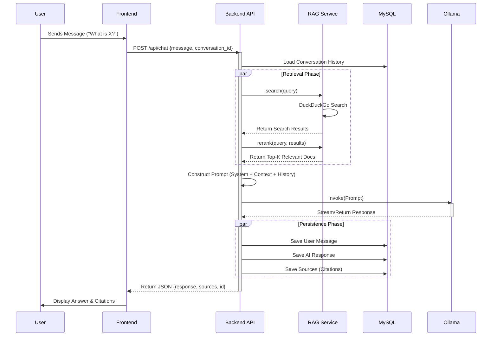
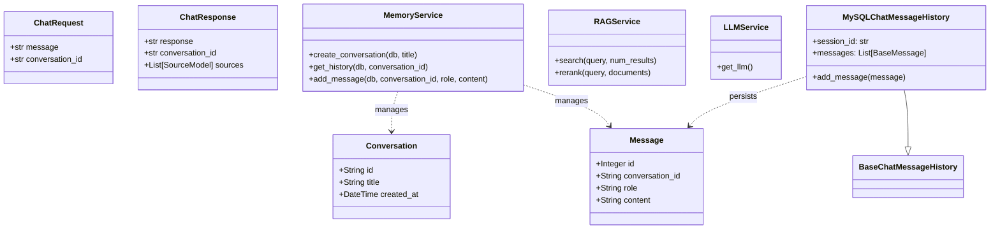
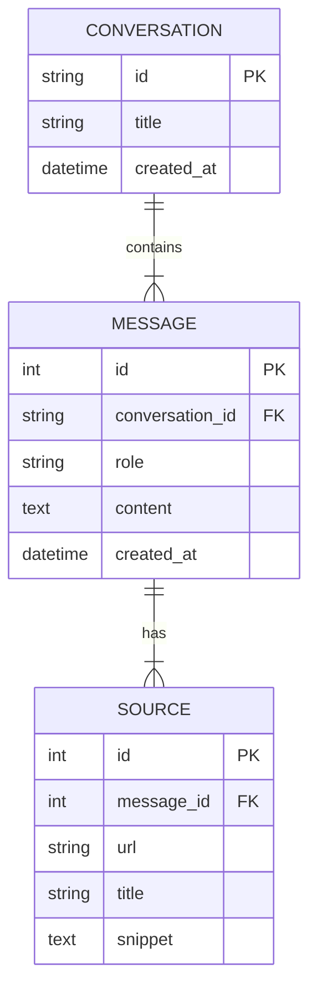

# System Design & Architecture

## 1. High-Level Architecture

The **AI Research Engine** follows a modern **Client-Server** architecture, designed for local deployment with privacy and modularity in mind.

### Core Components:
1.  **Frontend (Client)**: A Single Page Application (SPA) built with **React** and **TypeScript**. It handles user interaction, chat rendering, and state management.
2.  **Backend (Server)**: A RESTful API built with **FastAPI (Python)**. It orchestrates the AI logic, memory management, and external service integration.
3.  **Data Layer**: **MySQL** database for persistent storage of conversations, messages, and citations.
4.  **AI Layer**: **Ollama** for local Large Language Model (LLM) inference.
5.  **Retrieval Layer**: **DuckDuckGo** for web search and **Sentence Transformers** (optional) for reranking.

```mermaid
graph TD
    subgraph Client ["Frontend (React)"]
        UI[User Interface]
        API_Client[API Service]
    end

    subgraph Server ["Backend (FastAPI)"]
        Router[API Router]
        subgraph Services
            Memory[Memory Service]
            RAG[RAG Service]
            LLM_S[LLM Service]
        end
    end

    subgraph Infrastructure
        DB[(MySQL Database)]
        Ollama[Ollama (Local LLM)]
        DDG[DuckDuckGo Search]
    end

    UI --> API_Client
    API_Client -- HTTP/JSON --> Router
    Router --> Memory
    Router --> RAG
    Router --> LLM_S
    
    Memory -- SQL --> DB
    RAG -- HTTP --> DDG
    LLM_S -- HTTP --> Ollama
```

## 2. Sequence Diagram: Chat Flow

This diagram illustrates the lifecycle of a user message, from the frontend request to the final AI response with citations.



## 3. Backend Class Design

The backend is structured around modular services.



## 4. Database Schema


